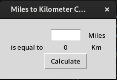
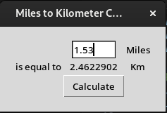

# Miles to Kilometers Converter

Create a basic and simple GUI application to convert miles to kilometers. The application is created using primarily the 'tkinter' module. Upon starting the application the user is shown a GUI menu with an empty entry widget in which the user can enter any float value for miles and after clicking on the 'convert' button the user is shown the equal value in kilometers. After the user has entered and converted a value, the user can simply enter a new value for miles and click the convert again and be shown the new value for that entry in kilometers.

## Screenshots:

a. Startup menu:

b. The user has entered a value for miles and is given the kilometers:

